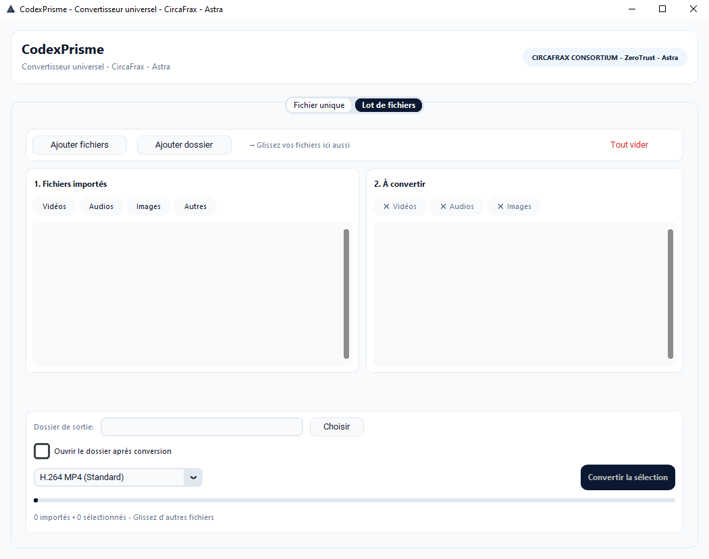

<p align="center">
  
</p>

# CodexPrism v1.0.0 - Le convertisseur universel 100% offline

<p align="center">
  
</p>

<p align="center">
  
  
  
  
</p>

<p align="center">

### ⬇️ [Télécharger CodexPrism v1.0.0 (Windows)](https://github.com/CircaFrax/CodexPrism/releases/download/v1.0.0/CodexPrism_v1.0.0.zip)

`SHA256: d19e82e2783e7e52123364951e47250658adc0b3f98eb9294e32f3cd6f271aa0`

</p>

---

### Pourquoi en offline ?

Services en ligne	CodexPrisme
Vos vidéos / audios sont uploadés sur un serveur distant	Vos fichiers ne quittent jamais votre PC
Watermark, limite de taille, compte obligatoire, pub	0 pub, 0 compte, 0 limite, 0 watermark
Nécessite une connexion	Fonctionne sans internet
Conditions floues sur la revente de vos médias	Confidentialité totale, vérifiable au pare-feu
Conçu pour les fichiers sensibles : rushs pro, audios perso, images clients, archives associatives.

## ✨ Le couteau suisse de la conversion

- **Vidéo -> Vidéo - MP4 / MKV / MOV / WebM / AVI sans ré-encodage inutile
- **Audio -> Audio - MP3 / WAV / FLAC / AAC / OGG / M4A
- **Vidéo -> Audio - extrait la piste en un clic
- **Image -> Image - JPG / PNG / WebP / BMP
- **Lot de fichiers - glissez 200 fichiers, choisissez un dossier de sortie
- **Fichier unique - prévisualisation, infos, même dossier ou dossier perso
- **Drag & Drop - depuis l'explorateur Windows directement
- **Dossier mémoire - il garde votre dernier dossier de sortie

## Aperçu

*Interface à trois onglets – Conversion en un clic*

### 📁 Contenu du Zip

```
CodexPrism/
├── CodexPdf.exe
├── LICENCE.md
├── LICENSE.md
└── THIRD_PARTY_LICENSES.md
```

Pas d'installation. Double-clic et c'est parti, comme en 1998 mais en mieux.

### 🔒 Confidentialité

- **Zéro réseau** : 100% offline, vérifiable au pare-feu
- **Zéro collecte** : n'écrit que les fichiers que vous demandez, dans le dossier que vous choisissez
- **100% légal** : FFmpeg sous licence LGPL/GPL + licences permissives complètes incluses dans le zip
- **Code source privé** : CircaFrax Proprietary Freeware v1.0

### 📄 Licence

Gratuit à vie, usage perso / associatif / pro / commercial. Distribution libre à l'identique avec les fichiers de licence.

Voir `LICENCE.md` et `THIRD_PARTY_LICENSES.md` inclus.

---

**Fait partie de la suite Codex** — des outils offline CircaFrax.
**CircaFrax - Astra - Marque de référence**
